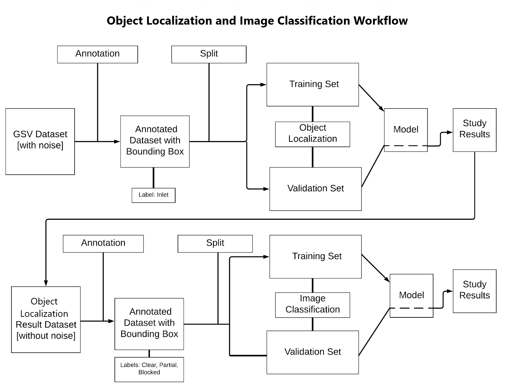

# Catch Basin Classifier
A catch basin classifier written in Python, Tensorflow, and Keras. Classification and mapping of stormwater infrastructure in Portland using AI and Google Street View (GSV).
Data (images) from Google Street View.

## Abstract
Stormwater infrastructure (SWI) is critical for transferring surface runoff, but frequent obstructions create localized flooding in metropolitan areas. We devise a new model using Google Street View (GSV) images and Artificial Intelligence (AI) convolutional neural network for image classification to classify the stormwater infrastructure into three classes: (1) clear (2), partially clear, and (3) partially blocked. The model is useful to build an SWI spatial database that can guide future investments in SWI management. The model can support urban stormwater management and flood risk management policies. This method is especially useful for municipal agencies to assess the status of SWI on a long-term basis to maintain a proactive maintenance schedule, thus urban flood risk can be mitigated.

## Setting Up

**NOTE**: *A saved model's file name is in format: `model-{number}-{training accuracy}-{validation accuracy}-{training loss}-{validation loss}`*

1. Clone the repo: `$ git clone github.com/SnkSynthesis/catch_basin_classifier`.
2. Open project in Jupyter Lab or Jupyter Notebook:
   * Run all cells of `object_localizer_model.ipynb`
   * Run all cells of `image_classifier_model.ipynb`
3. Update two lines of `config.py` (example file name: `model-0-0.65-0.54-0.7-1.09`):
```python
# Following values must be changed if there are no saved models or a different model needs to be used.
image_classifier_model_name = 'file name of desired model in saved_models/image_classifier_models'
object_localizer_model_name = 'file name of desired model in saved_models/object_classifier_models'
```
4. Run `$ python pipeline.py`. Running `pipeline.py` will:
   * Loads models based on `config.py`.
   * Prompts for path of image to predict upon
   * Shows the image with bounding box prediction of object_localizer_model (given image with red bounding box)
   * Shows prediction of image_classifier_model (in both one-hot-encoded and text format)

## Workflow
</img>
